# Portal de Transparencia y Gestión Financiera — Santo Domingo

Sistema web para la publicación y gestión de información financiera municipal bajo la **Ley 20.285** de Chile (Transparencia Activa). Incluye un portal ciudadano de consulta pública y un panel administrativo protegido con autenticación.

Proyecto del curso **ICI 4247 — Ingeniería Web y Móvil**, PUCV. Entrega Final.

Los datos sembrados se basan en información pública oficial de la I. Municipalidad de Santo Domingo, Región de Valparaíso (ver `Otros/FUENTES_DATOS.md`).

| Capa | Tecnología |
| --- | --- |
| FrontEnd | React 19, Vite, TypeScript, Tailwind CSS, React Router 7 |
| BackEnd | Node.js, Express 5, Prisma ORM 7, JWT, bcrypt, Helmet, express-rate-limit |
| Base de datos | PostgreSQL 15 |
| Servicio externo | mindicador.cl (indicadores económicos UF/UTM/dólar/euro) |
| Infraestructura | Docker & Docker Compose, Nginx |

---

## 1. Estructura del repositorio

```
Portal_Transparencia_SantoDomingo_Final/
├── docker-compose.yml          ← orquesta los 3 servicios (EF6)
├── .env / .env.example         ← variables consumidas por compose
├── README.md
├── readme.txt                  ← URL del repo (para Aula Virtual)
├── BackEnd/                     ← API REST + Prisma + PostgreSQL
│   ├── dockerfile
│   ├── package.json
│   ├── .env / .env.example
│   ├── prisma/
│   │   ├── schema.prisma
│   │   ├── seed.js
│   │   └── migrations/
│   └── src/
│       ├── app.js               ← punto de entrada (Express)
│       ├── config/db.js
│       ├── controllers/         ← auth, admin, public
│       ├── routes/
│       ├── middlewares/
│       └── schemas/             ← validación con Zod
├── FrontEnd/                    ← portal + panel admin (Vite/React)
│   ├── Dockerfile
│   ├── nginx.conf
│   ├── .env / .env.example
│   └── src/app/
│       ├── pages/
│       ├── components/
│       ├── routes.tsx
│       └── App.tsx
└── Otros/                       ← material de apoyo (rúbrica: carpeta "otros")
    ├── FUENTES_DATOS.md
    ├── DESAFIOS_IMPLEMENTACION.md
    └── RUBRICA_CHECKLIST.md
```

---

## 2. Puesta en marcha con Docker (recomendado)

Es la vía oficial de despliegue (EF6) y la más simple: levanta base de datos, API y frontend con un solo comando.

### Requisitos previos
- Docker Desktop (o Docker Engine + plugin Compose v2).
- Puertos libres en el host: **8080** (web), **3000** (API), **5432** (PostgreSQL).

### Pasos

```bash
# 1. Situarse en la raíz del proyecto (donde está docker-compose.yml)
cd Portal_Transparencia_SantoDomingo_Final

# 2. Crear el archivo de variables a partir del ejemplo
cp .env.example .env          # en Windows PowerShell: copy .env.example .env

# 3. Construir y levantar todo en segundo plano
docker compose up -d --build
```

La primera vez, la API ejecuta automáticamente, **en orden**:
1. `prisma migrate deploy` — crea las tablas (incluye índices de optimización).
2. `prisma db seed` — inserta departamentos, presupuestos, contratos y el usuario administrador.
3. `npm start` — arranca el servidor Express.

Esto ocurre **después** de que PostgreSQL esté saludable (`depends_on: condition: service_healthy`), evitando la condición de carrera habitual.

### Acceso

| Servicio | URL |
| --- | --- |
| Portal ciudadano (Frontend) | http://localhost:8080 |
| API REST | http://localhost:3000/api |
| Indicadores (prueba del servicio externo) | http://localhost:3000/api/indicadores |

### Credenciales del administrador (sembradas)

```
Correo:      admin@santodomingo.cl
Contraseña:  clave123
```

Inicie sesión en http://localhost:8080/login para acceder al panel `/admin` (CRUD de departamentos, presupuestos y contratos).

### Comandos útiles

```bash
docker compose logs -f api     # ver logs de la API (migración/seed/arranque)
docker compose ps              # estado de los contenedores
docker compose down            # detener y eliminar contenedores
docker compose down -v         # además, borrar el volumen de la BD (reinicio limpio)
```

---

## 3. Ejecución en modo desarrollo (sin Docker)

Útil para desarrollar con recarga en caliente. Requiere Node.js 20+ y un PostgreSQL local en ejecución.

### Backend

```bash
cd BackEnd
cp .env.example .env
# Editar .env: ajustar DATABASE_URL a su PostgreSQL local y añadir DB_INTERNAL_HOST=""
# (DB_INTERNAL_HOST="" desactiva la reescritura localhost->db pensada para Docker)

npm install
npx prisma migrate deploy
npx prisma db seed
npm run dev                    # nodemon en http://localhost:3000
```

### Frontend

```bash
cd FrontEnd
cp .env.example .env           # VITE_API_URL=http://localhost:3000/api
npm install
npm run dev                    # Vite en http://localhost:5173
```

El backend ya permite el origen `http://localhost:5173` en su lista blanca de CORS.

---

## 4. Cumplimiento de la rúbrica (Entrega Final)

Resumen del mapeo; el detalle por criterio está en `Otros/RUBRICA_CHECKLIST.md`.

| Criterio | Dónde se evidencia |
| --- | --- |
| **EF1** — Funcionalidades completas e integración | CRUD real en panel `/admin`, autenticación JWT, roles (ADMIN), notificaciones (toasts de `sonner`), almacenamiento local del token, integración front-back vía `fetch`. |
| **EF2** — UI/UX y rendimiento | Diseño responsivo (móvil/web), navegación coherente, paginación, compresión gzip y caché de estáticos en Nginx. |
| **EF3** — Seguridad de la API | Hash bcrypt, JWT firmado y validado, CORS por lista blanca, cabeceras con Helmet, rate limiting en `/api/auth`, validación de inputs con Zod, ORM Prisma (consultas parametrizadas → mitiga inyección SQL). |
| **EF4** — Optimización de consultas | Índices en columnas de filtro/orden (`@@index`), paginación con `skip/take` y `count`, `orderBy`, respuestas que no exponen datos innecesarios. |
| **EF5** — Servicio externo | Endpoint `/api/indicadores` que actúa como proxy a mindicador.cl, con timeout, manejo de errores y variable de entorno `MINDICADOR_API_URL`. Se consume en la portada (componente `EconomicIndicators`). |
| **EF6** — Despliegue con Docker | `Dockerfile` de backend y frontend + `docker-compose.yml` orquestando los tres servicios, variables de entorno e instrucciones de despliegue. |

> **Nota honesta sobre el stack de UI.** La rúbrica menciona componentes de Ionic en su nivel "Excelente". Este proyecto fue desarrollado desde las entregas parciales con **React + Vite + Tailwind/shadcn**, no con Ionic. Migrar a Ionic a esta altura implicaría reescribir la capa de presentación completa, fuera del alcance de la integración final. El resto de los criterios (funcionalidad, seguridad, optimización, servicio externo y Docker) es independiente del framework de UI y se cumple en su totalidad. Esta decisión y su justificación se documentan para la defensa.

---

## 5. Notas de arquitectura

- **Backend en capas:** rutas → middlewares (auth/rol/validación) → controladores → Prisma. Las respuestas siguen un formato JSON uniforme (`{ success, data | error }`).
- **Autenticación:** el token JWT (vigencia 8 h) se guarda en `localStorage`. El frontend protege la ruta `/admin` con un guardia declarativo (`ProtectedRoute`) además del control interno de la vista.
- **Reescritura de host de BD:** `src/config/db.js` traduce `localhost`→`db` para que la misma cadena de conexión sirva en local y en Docker. En `docker-compose.yml`, la `DATABASE_URL` de la API ya apunta directamente a `db` porque la **CLI de Prisma** (migración/seed) no pasa por esa reescritura.
- **Servicio externo desacoplado:** el frontend nunca llama a mindicador.cl directamente; lo hace a través del backend, centralizando errores, timeout y CORS.

Para los desafíos técnicos encontrados durante la integración de las dos bases de código y cómo se resolvieron, ver `Otros/DESAFIOS_IMPLEMENTACION.md`.


---


# Portal de Transparencia y Gestión Financiera — Santo Domingo

Sistema completo para la gestión y publicación de información financiera municipal bajo la Ley 20.285 de Chile. Incluye un BackEnd con API REST y un FrontEnd con portal ciudadano y panel administrativo.

Los datos sembrados se basan en información pública oficial verificada de la I. Municipalidad de Santo Domingo, Región de Valparaíso (ver `Otros/FUENTES_DATOS.md`).

| Capa | Tecnología |
| --- | --- |
| FrontEnd | React 18, Vite, TypeScript, Tailwind CSS, React Router |
| BackEnd | Node.js, Express, Prisma ORM, JWT (autenticación), bcrypt (hashing) |
| Base de datos | PostgreSQL 15 |
| Infraestructura | Docker & Docker Compose |

---

## Estructura del repositorio

```
Portal_ICI4247-main/
├── README.md
├── BackEnd/                    ← API REST + base de datos
│   ├── compose.yaml
│   ├── dockerfile
│   ├── package.json
│   ├── prisma/
│   │   ├── schema.prisma        ← ORM Base de Datos PostgreSQL
│   │   ├── seed.js
│   │   └── migrations/
│   ├── src/
│   ├── .env.example
│   └── .gitignore
├── FrontEnd/                   ← Portal ciudadano + panel admin
│   ├── package.json
│   ├── vite.config.ts
│   ├── index.html
│   ├── src/
│   ├── .env.example
│   └── .gitignore
└── Otros/                      ← Material complementario
    └── FUENTES_DATOS.md        ← Trazabilidad de los datos del seed
```

---
---

## Modelo de Base de Datos

El sistema utiliza una base de datos relacional administrada a través de **Prisma ORM**. A continuación se presenta el diagrama de entidad-relación que representa la estructura de las tablas (`Usuario`, `Departamento`, `Presupuesto`, `Contrato`) y sus respectivas relaciones:

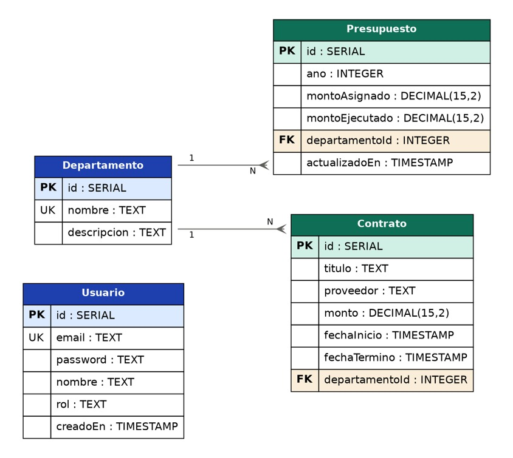

> **Nota:** Las restricciones de integridad, claves foráneas y tipos de datos están definidos en el archivo `BackEnd/prisma/schema.prisma`.


## Requisitos previos

Antes de empezar, instala lo siguiente:

### 1. Docker Desktop
Empaqueta y ejecuta el servidor Express y la base PostgreSQL en contenedores aislados.

- Descarga: [docker.com/products/docker-desktop](https://www.docker.com/products/docker-desktop/)
- Después de instalar, **ábrelo siempre antes de trabajar**. El ícono de la ballena en la barra de tareas debe estar en verde.

### 2. Node.js (versión 18 o superior)
Ejecuta el FrontEnd e instala sus dependencias.

- Descarga el LTS: [nodejs.org](https://nodejs.org/)
- Incluye `npm` automáticamente.

### 3. Un editor de código
[VS Code](https://code.visualstudio.com/) es buena opción, pero cualquiera sirve.

### Verifica la instalación

Abre un cmd o **PowerShell** y ejecuta:

```powershell
docker --version
node --version
npm --version
```

Si los tres responden con un número de versión, estás listo.

---

## Puesta en marcha — Paso a paso

Necesitarás **dos terminales de PowerShell** abiertas al mismo tiempo: una para el BackEnd y otra para el FrontEnd.

### Parte A — BackEnd (Terminal 1)

#### A.1 Abre Docker Desktop

Confirma que el ícono de la ballena esté en verde antes de seguir.

#### A.2 Entra a la carpeta del BackEnd

En la **Terminal 1**, navega a la carpeta del backend. Reemplaza la ruta por la que corresponda a tu computador:

```powershell
cd C:\Users\TuUsuario\Desktop\Portal_ICI4247-main\BackEnd
```

> **Truco:** en el Explorador de Windows puedes hacer clic en la barra de direcciones para ver la ruta completa y copiarla.

#### A.3 Crea el archivo `.env`

Este paso es **obligatorio**. El archivo `.env` contiene las credenciales de la base de datos. No viene en el repositorio por seguridad. La carpeta incluye un `.env.example` que muestra qué variables se necesitan.

La forma más segura en Windows es crear el archivo desde PowerShell:

```powershell
notepad .env
```

Notepad se abrirá. Pega este contenido tal cual:

```env
PORT=3000
JWT_SECRET="supersecretjwtkey_municipalidad2026"

DB_USER="admin"
DB_PASSWORD="adminpassword"
DB_NAME="transparencia_db"

DATABASE_URL="postgresql://admin:adminpassword@db:5432/transparencia_db?schema=public"
```

Guarda (Ctrl+S) y cierra Notepad. Verifica que el archivo existe:

```powershell
dir -Force .env
```

Debe aparecer en la lista.

> **Cuidado con la extensión oculta de Windows:** si creas el archivo con clic derecho → "Nuevo documento de texto", Windows le pone `.txt` invisible y queda como `.env.txt`. Por eso usa `notepad .env` desde PowerShell.

#### A.4 Levanta los contenedores

```powershell
docker compose up -d --build
```

Esto descarga las imágenes, construye la API y levanta dos contenedores:
- `transparencia_db` — la base de datos PostgreSQL.
- `api_transparencia` — el servidor Express.

La primera vez tarda alrededor de **30 segundos**. Confirma que ambos están corriendo:

```powershell
docker ps
```

Debes ver los dos contenedores con estado `Up`.

#### A.5 Crea las tablas en la base de datos

La base existe pero está vacía. Aplica las migraciones de Prisma para crear las tablas (`Usuario`, `Departamento`, `Presupuesto`, `Contrato`):

```powershell
docker compose exec api npx prisma migrate deploy
```

Debes ver un mensaje parecido a `1 migration applied`.

#### A.6 Carga datos reales de Santo Domingo (seed)

Las tablas existen pero están vacías. Para que el portal se vea con contenido desde el primer momento, ejecuta el script de seed. Crea:

- 1 usuario administrador con credenciales conocidas.
- 18 direcciones municipales reales (Alcaldía, DOM, DAEM, DIDECO, etc.).
- 22 presupuestos basados en las cifras BEP 2025 oficiales del SINIM.
- 12 contratos públicos con títulos reales de Mercado Público.

```powershell
docker compose exec api npm run seed
```

Al finalizar verás un resumen con las **credenciales del usuario administrador**:

### **Si no funciona**

1. Detener los contenedores y destruir el volumen con ```docker compose down -v```
2. Reconstruir la infraestructura docker compose up ```-d --build```
3. Ejecutar migración ```docker compose exec api npx prisma migrate deploy```

```
  Seed completado correctamente.
───────────────────────────────────────────────
   Credenciales de prueba:
     Email:      admin@santodomingo.cl
     Contraseña: clave123
───────────────────────────────────────────────
```

> El seed es **idempotente**: si lo ejecutas dos veces, la segunda detecta los datos ya cargados y no hace nada. Para reiniciar a un estado limpio, ver la sección "Reiniciar todo desde cero" más abajo.
>
> Para conocer las fuentes y la trazabilidad de cada dato sembrado, consulta `Otros/FUENTES_DATOS.md`.

#### A.7 Verifica que la API responde

Abre tu navegador y entra a:

```
http://localhost:3000/api/health
```

Debe responder:

```json
{"status":"success","message":"API del Portal de Transparencia operando correctamente"}
```

Si llegas aquí, **el BackEnd está listo**. Deja la Terminal 1 abierta y pasa a la siguiente parte.

---

### Parte B — FrontEnd (Terminal 2)

#### B.1 Abre una segunda terminal de PowerShell

Déjala separada de la del BackEnd.

#### B.2 Entra a la carpeta del FrontEnd

```powershell
cd C:\Users\TuUsuario\Desktop\Portal_ICI4247-main\FrontEnd
```

#### B.3 Crea el archivo `.env`

Igual que en el BackEnd, el FrontEnd necesita su propio `.env`. Créalo con:

```powershell
notepad .env
```

Pega:

```
VITE_API_URL=http://localhost:3000/api
```

Guarda y cierra.

#### B.4 Instala las dependencias

```powershell
npm install
```

Tarda alrededor de un minuto. Es normal que aparezcan algunos `warning`; ignóralos mientras no haya `error`.

> **OJO:** Si trabajas desde una terminal "PowerShell" en Visual Studio Code y te aparece que la ejecución de scripts está deshabilitada en el sistema. Puedes instalar las dependencias desde una terminal "Command Prompt", abre una tercera terminal cmd y ejecuta de aquí en adelante:
> ```powershell
> cd C:\Users\TuUsuario\Desktop\Portal_ICI4247-main\FrontEnd
> npm install
> ```

#### B.5 Levanta el servidor de desarrollo

```powershell
npm run dev
```

Verás algo como:

```
  VITE v6.3.5  ready in 800 ms

  ➜  Local:   http://localhost:5173/
```

Abre esa URL en el navegador.

---

## Cómo probar que la unión FrontEnd ↔ BackEnd funciona

> **Si ya ejecutaste el seed (paso A.6)**, ya tienes el usuario administrador y datos reales cargados. Inicia sesión directamente en `/login` con `admin@santodomingo.cl` / `clave123` para ver el portal lleno.

Sigue este guion completo. Si todos los pasos funcionan, la integración está correcta.

### 1. Registrar un nuevo funcionario (opcional)
> Esta sección está hecha exclusivamente para que el ayudante pueda seguir probando nuestro programa como admin y se eliminará en la entrega final.
1. Ve a `http://localhost:5173/registro`
2. Llena el formulario:
   - **Nombre:** `Juan Pérez`
   - **RUT:** `12345678-9`
   - **Email:** `jperez@santodomingo.cl`
   - **Región / Comuna:** Valparaíso / Santo Domingo
   - **Contraseña:** `clave123` (mínimo 6 caracteres)
   - Acepta términos.
3. Haz clic en **"Registrarse"**. Debe mostrar "¡Registro Exitoso!" y redirigir a `/login`.

> Si abres las DevTools del navegador (F12 → Network), verás la petición `POST http://localhost:3000/api/auth/register` con código `201`.

### 2. Iniciar sesión

1. En `/login`, usa las credenciales del seed: `admin@santodomingo.cl` / `clave123`.
2. Te redirige a `/admin`. En el encabezado verás "Sesión: Encargado de Transparencia Municipal (ADMIN)".

> La petición `POST /api/auth/login` devuelve un **token JWT real** (tres segmentos separados por puntos) que se guarda en `localStorage`.

### 3. Explorar el panel administrativo

En `/admin` hay tres pestañas:

- **Departamentos** — 18 direcciones municipales reales.
- **Presupuestos** — 22 presupuestos por dirección (2025 y 2026 parcial).
- **Contratos** — 12 contratos públicos.

Desde aquí puedes crear, editar o eliminar registros. Cada acción dispara una llamada al backend con el JWT.

### 4. Ver los datos en las páginas públicas

Navega a:

- `http://localhost:5173/estructura` → 18 direcciones.
- `http://localhost:5173/presupuesto` → gráfico de torta con la distribución del presupuesto 2025.
- `http://localhost:5173/contrataciones` → tabla y gráfico con los contratos.

Arriba a la derecha de cada página verás un badge verde **"Datos en vivo (API)"**. Esa es la confirmación visual de que los datos vienen del BackEnd real.

### 5. Prueba de seguridad

1. Cierra sesión (botón en el header).
2. Intenta ir directo a `http://localhost:5173/admin` → te redirige a `/login` (ruta protegida).
3. Las páginas públicas siguen funcionando.

### 6. Prueba del respaldo de demostración

Para confirmar que las páginas dependen realmente del BackEnd, apágalo desde la Terminal 1:

```powershell
docker compose stop api
```

Refresca `/estructura` en el navegador. Ahora el badge verde se vuelve **ámbar: "Datos de demostración"**. Vuelve a levantarlo:

```powershell
docker compose start api
```

Refresca → vuelve el badge verde. ✅

---

## Referencia de la API

Link Postman: https://ian-guerrero-v-8323707.postman.co/workspace/Ian-Misael's-Workspace~c5150f23-3f8d-4ddd-85d6-5496094bcc47/collection/55372631-deeca7b4-b35a-4479-b35d-fec346f26572?action=share&creator=55372631&active-environment=55372631-593d5004-e9e3-4ea5-82df-3405cc1b37ad

### Autenticación (público)
| Método | Endpoint | Descripción |
| --- | --- | --- |
| `GET` | `/registro` | Registra un funcionario municipal (rol ADMIN por defecto) |
| `POST` | `/api/auth/login` | Valida credenciales y devuelve un JWT |

> Tras correr el seed, el usuario administrador está disponible: `admin@santodomingo.cl` / `clave123`.

### Datos públicos
| Método | Endpoint | Descripción |
| --- | --- | --- |
| `GET` | `/api/categorias` | Lista las categorías para ver la información detallada según la Ley 20.285 |
| `GET` | `/api/estructura` | Presenta el organigrama y descripción de las unidades del municipio |
| `GET` | `/api/remuneraciones` | Lista los sueldos brutos y líquidos de todos los funcionarios municipales |
| `GET` | `/api/contrataciones` | Lista los contratos vigentes y proveedores del municipio |
| `GET` | `/api/transferencias` | Presenta las transferencias a organizaciones y beneficiarios externos |
| `GET` | `/api/presupuesto` | Muestra la distribución del presupuesto municipal por departamento |
| `GET` | `/api/subsidios` | Lista los programas sociales y beneficios entregados a la comunidad |
| `GET` | `/api/actos` | Lista los decretos, resoluciones, permisos y concesiones que afectan a terceros |
| `GET` | `/api/auditorias` | Muestra los resultados de auditorías internas y externas realizadas por organismos fiscalizadores |
| `GET` | `/api/tramites` | Entrega los requisitos y procedimientos para realizar trámites en el municipio |
| `GET` | `/api/presupuestos` | Lista presupuestos con su departamento |
| `GET` | `/api/participacion` | Lista las consultas ciudadanas, COSOC, audiencias públicas y otras instancias de participación |

### Administración (Requiere JWT con rol ADMIN)
| Método | Endpoint | Descripción |
| --- | --- | --- |
| `POST` | `/api/admin/departamentos` | Crea un nuevo departamento municipal. |
| `PUT` | `/api/admin/departamentos/:id` | Actualiza la información de un departamento. |
| `POST` | `/api/admin/presupuestos` | Asigna un presupuesto a un departamento. |
| `PUT` | `/api/admin/presupuestos/:id` | Actualiza montos o año de un presupuesto. |
| `POST` | `/api/admin/contratos` | Registra un nuevo contrato público. |
| `PUT` | `/api/admin/contratos/:id` | Actualiza detalles de un contrato existente. |
| `DELETE` | `/api/admin/contratos/:id` | Elimina un contrato mediante su ID. |

---

## Respuestas exitosas de Postman

### 1. Registro de Funcionario

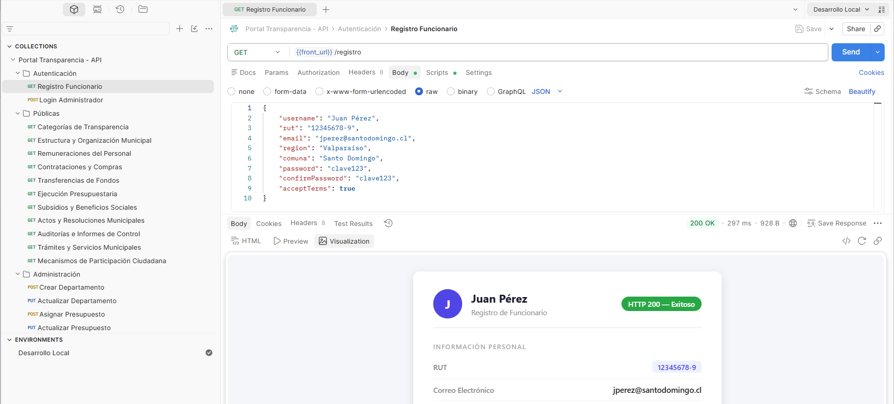
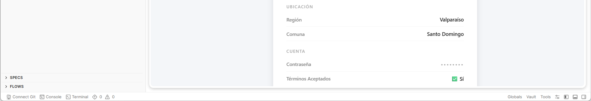

### 2. Login de Administrador

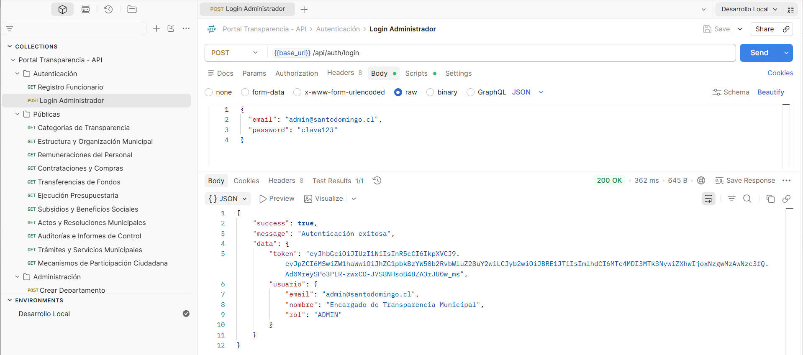

### 3. Crear Departamento

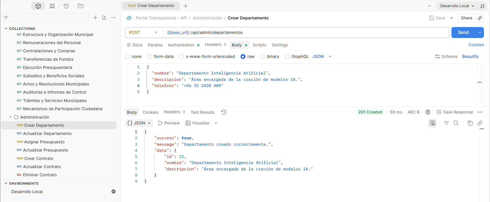

### 4. Actualizar Departamento

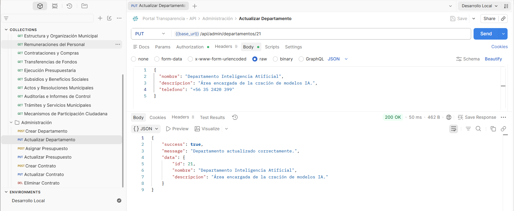

### 5. Asignar Presupuesto

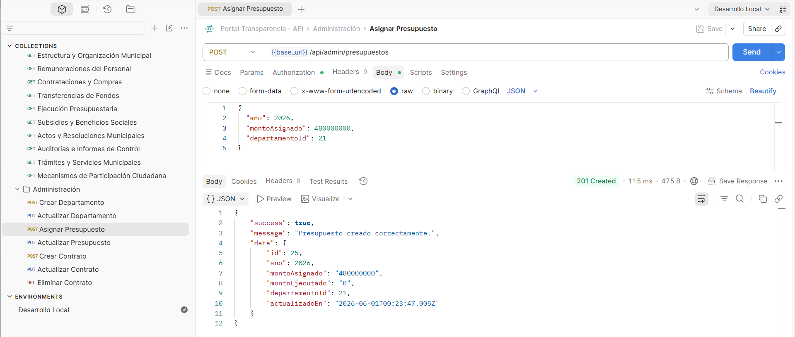

### 6. Actualizar Presupuesto

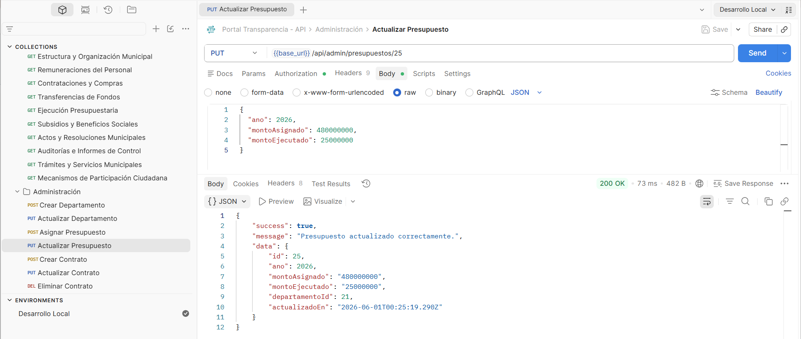

### 7. Crear Contrato

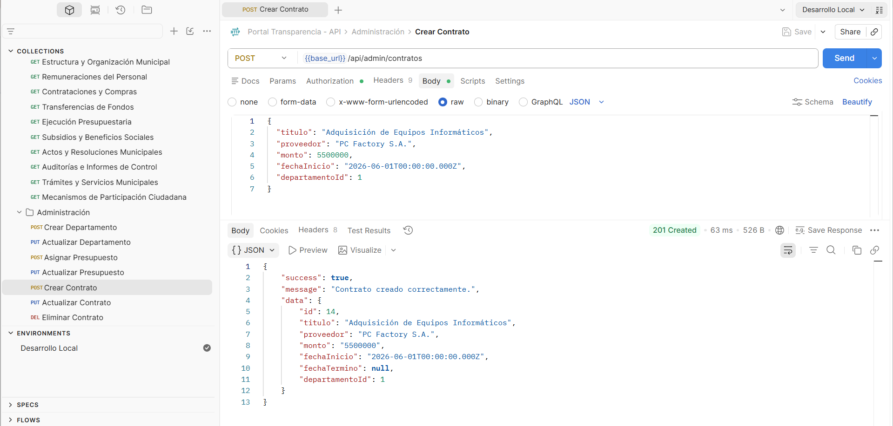

### 8. Actualizar Contrato

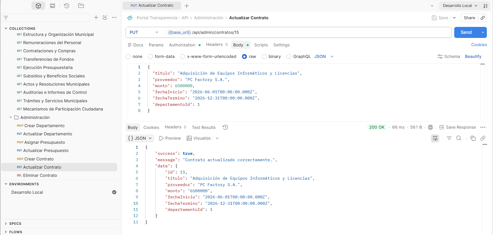

### 9. Eliminar Contrato

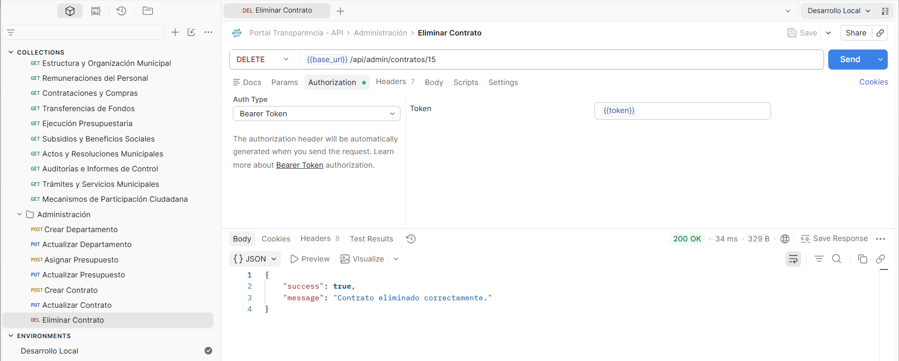

## Comandos útiles

### BackEnd (Docker)

```powershell
# Ver logs en vivo de la API
docker logs -f api_transparencia

# Reiniciar solo la API
docker compose restart api

# Detener todo (los datos se mantienen)
docker compose stop

# Reanudar todo
docker compose start

# Borrar todo, incluida la base de datos (reiniciar todo desde cero)
docker compose down -v
```

### Reiniciar todo desde cero

Si quieres volver a un estado completamente limpio con los datos del seed:

```powershell
cd ...\Portal_ICI4247-main\BackEnd
docker compose down -v
docker compose up -d --build
docker compose exec api npx prisma migrate deploy
docker compose exec api npm run seed
```

### FrontEnd (Vite)

Mientras `npm run dev` esté corriendo, los cambios en archivos `.tsx` se recargan automáticamente en el navegador. Para detenerlo presiona `Ctrl+C` en la Terminal 2.

Para compilar la versión de producción:

```powershell
npm run build
```

Los archivos finales quedan en la carpeta `dist/`.

---

## Solución de problemas comunes

### `The "DB_USER" variable is not set. Defaulting to a blank string.`
Te falta crear el archivo `.env` en la carpeta del BackEnd. Vuelve al paso **A.3**.

Si ya lo creaste pero sigue fallando:
- Verifica que se llama exactamente `.env` (no `.env.txt` ni `env`).
- Está en la **misma carpeta** que `compose.yaml`.
- Usa `notepad .env` desde PowerShell para crearlo sin extensiones ocultas.

### `P1000: Authentication failed against database server`
La base arrancó la primera vez sin el `.env` y guardó esa configuración en su volumen. Hay que borrar el volumen y empezar limpio:

```powershell
docker compose down -v
# Asegúrate de que el .env existe y tiene el contenido correcto
docker compose up -d --build
docker compose exec api npx prisma migrate deploy
docker compose exec api npm run seed
```

### `port is already allocated` o el puerto 3000 / 5432 está ocupado
Otro programa está usando ese puerto. Opciones:
- Detén el otro programa.
- Edita `compose.yaml` y cambia `"3000:3000"` por `"3001:3000"`, luego actualiza el `.env` del FrontEnd a `VITE_API_URL=http://localhost:3001/api`.

### El FrontEnd dice "No se pudo conectar con el servidor"
- Confirma que `http://localhost:3000/api/health` responde en el navegador.
- Confirma que Docker Desktop está corriendo (ícono verde).
- Revisa los logs: `docker logs api_transparencia`.

### `npm install` falla
- Verifica que tienes Node 18 o superior con `node --version`.
- Borra `node_modules` y `package-lock.json` y reintenta:
  ```powershell
  Remove-Item -Recurse -Force node_modules
  Remove-Item package-lock.json
  npm install
  ```

### "Las tablas no existen" o errores Prisma `P2021`
No ejecutaste las migraciones del paso **A.5**. Hazlo:

```powershell
docker compose exec api npx prisma migrate deploy
```

### El portal aparece vacío al entrar
No ejecutaste el seed del paso **A.6**. Hazlo:

```powershell
docker compose exec api npm run seed
```

---

## Notas finales

- El archivo `.env` **nunca debe subirse a Git** (está en el `.gitignore`). Cada persona que clone el proyecto debe crear el suyo siguiendo los pasos A.3 y B.3.
- El primer usuario registrado queda automáticamente con rol `ADMIN`. En un sistema productivo conviene cambiar esa política.
- Las fuentes de los datos del seed están documentadas en `Otros/FUENTES_DATOS.md`.

---

**Proyecto desarrollado en el marco del cumplimiento de la Ley 20.285 sobre Acceso a la Información Pública — I. Municipalidad de Santo Domingo, Región de Valparaíso, Chile.**

